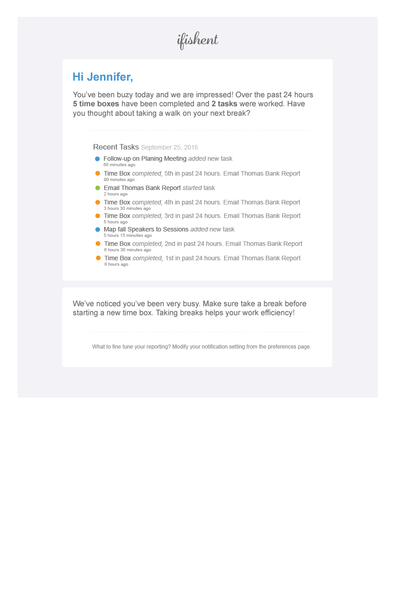

# Milestone 2 Blockers

# Blocker 
## September 25, 2016

Today, I need to think through the application's insights email. The information the application's persona(s) will find insightful is a task, to say the least. Just to recap, Michael (the primary persona) is a white American male in his early 40’s living in California – since California has the highest number of developer jobs (United States Department of Labor, 2012). He recently resigned from the Angular team at Google, leaving behind a $124,000.00 paycheck to join a new startup (zSpace) in Palo Alto, California. Jennifer, the secondary persona is a white American female in her mid 40’s living in California – California has the highest number of technical writer jobs (United States Department of Labor, 2014). She has worked a zSpace in Palo Alto, California for the past year.

I need to identify the specific information each persona might want to know. A possible starting point is gender - as gender influences what "things" are insightful. The male persona enjoys an application's "features" and the "cool" things it may do. Flip that on its head, females strip the application down to its core and want to know how the application works to their advantage. 

One approach might be creating two email templates for each gender. I like this idea, however it is not lean. A blended solution accommodating both Jennifer and Michael may include:

1. A simple introduction greeting the individual user
2. Thank them for using the application
2. Time block count
3. Task touched in the last 24 hours
4. Time spent on each task
5. Suggestions 
6. More time between time blocks
7. Activities to do when taking a break
 
The result:
 
  
  