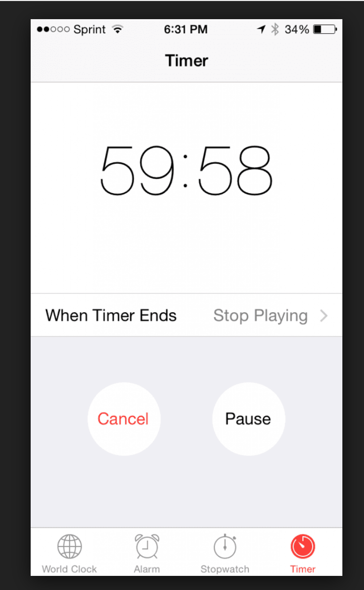
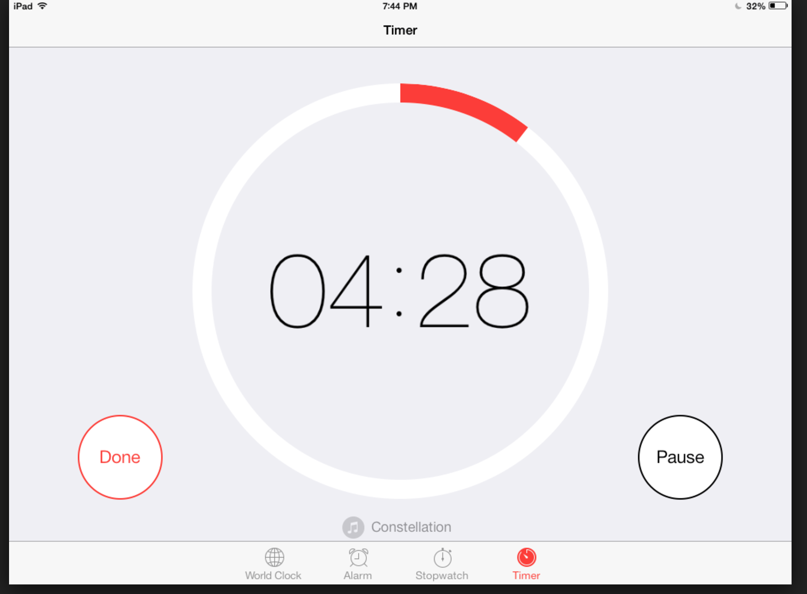

# Stand-up
## November 12, 2016

### Last 24 
    * Fixed Angular 2 bug: push new tasks to mobile dashboard.
    * Created publish/subscribe events to notifiy Ionic 2 controllers when task are changed.
    * Research possible iOS timer UI elements and discoverd two possible solutions:   

### Next 24 
    * Create a new timer mock-up
    * Code up the timer UI in mobile
    * Wire up calls to/from mobile and API to create, update timer
    